# Securing AWS EKS & Kubernetes Outgoing Traffic with a Proxy

## Why use a Proxy ?

When deploying AWS EKS (or Kubernetes), access to the internet from the cluster nodes is generally required in order to provide one or more of the following:
1. Download code from nominated external code control repo (e.g. git).
2. Download containers from trusted registries. 
3. Communication with other AWS services which cannot be accessed internally.

As part of your security controls, it is prudent to have a mechanism that can restict access to a pre-approved whitelist of destination URLs.  

Here, we demonstrate how EKS nodes can be secured inside private subnets, and how outgoing http requests can be made secure by using EC2 Proxies running Squid software. The same pattern can be employed for non-EKS Kubernetes.

The benefits of this outgoing proxy solution are:

 
1. Public access to your EKS nodes is not enabled (i.e. the nodes are in Private subnets, and incoming access via the proxies is blocked)
2. Outgoing connectivity can be filtered on URL of trusted domains - this protects against code which attempts to download malware - either intentionally or unintentionally. For example outgoing access can be restricted to only amazon aws services if the whitelist contains only '.amazonaws.com'.
3. Outgoing connectivity can be monitored and unapproved outgoing access attempts can be configured to raise alerts.
4. Elastic IPs can be attached to each proxy instance - this is useful when destination websites have their own whitelist of allowed traffic that they accept connections from.
5. Highly Availabile Architecture (proxies across multiple Availability Zones).
6. Fully Scalable Architecture (using AWS Scaling Group to scale up outgoing proxies as required).

[Cloudformation templates used in this post can be found here.](https://github.com/scalinglogic/eks-vpc-proxy)

## Solution Architecture


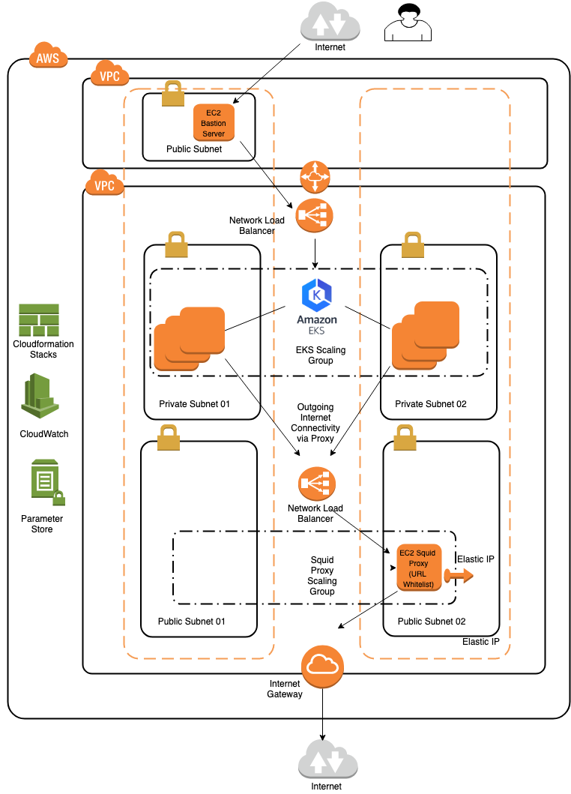


## Deployment/Configuration Instructions


Assumptions are that a VPC already exists (default VPC for example) in which exists a Linux EC2 instance that is configured with kubernetes kubectl client and all associated software.  This is shown as the 'EC2 Bastion Server' in the Solution Architecture.

### 1. Create an EKS specific VPC using EKS-VPC.yaml

This Cloudformation Stack performs the following actions:
- Creates the VPC for EKS 
- Creates two public subnets which will be used for the proxy EC2 instance(s)
- Creates two private subnets for the EKS Node Group


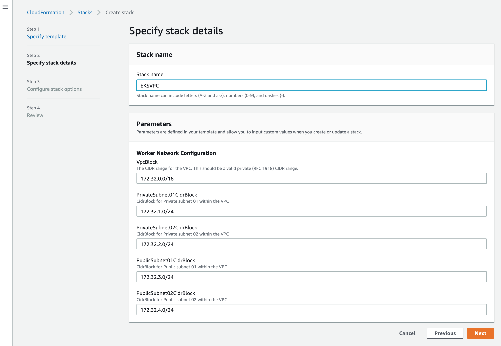

The outputs are exported from the Stack for use by subsequent Cloudformation Stacks.

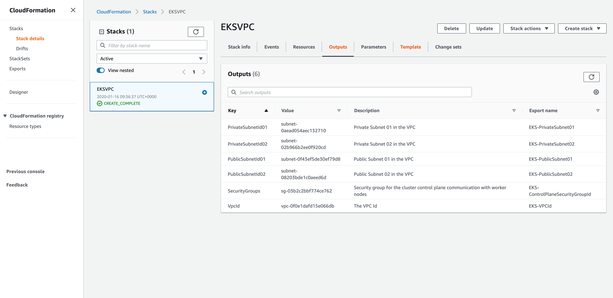

### 2. Create the EKS Service Role using EKS-ServiceRole.yaml

This Cloudformation Stack creates an EKS Service Role, which allows Amazon EKS to call other AWS Services on our behalf to manage EKS resources.

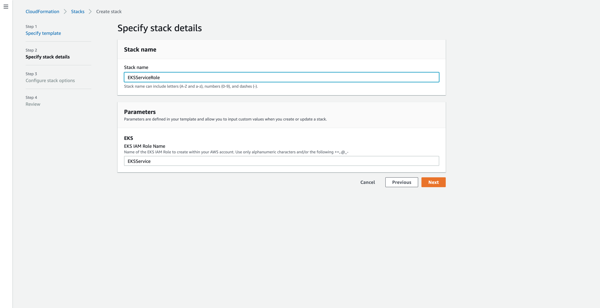

### 3. Create the EKS Cluster using EKS-CreateCluster.yaml

This Cloudformation Stack creates the EKS cluster. In our case we have called the cluster 'EKSdemo'. 

This step can take around 10 minutes, as a new VPC in AWS containing master/etcd EC2 nodes is created. 

The infrastructure created here is totally under the control and management of AWS and as such we can only see this as an EKS cluster in our console - we cannot see its VPC, loadbalancers or EC2 instances.

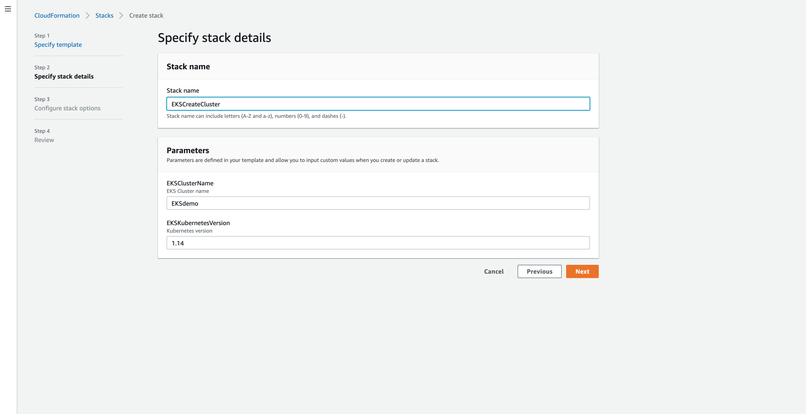

Following creation of the EKS cluster take a note of the API endpoint URL for later use.

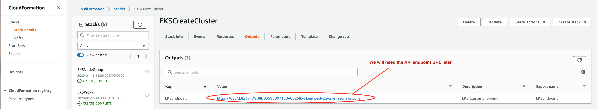


### 4. Making the EKS Cluster API endpoint private

Cloudformation does not allow us to create the EKS cluster with a private API endpoint, but defaults to a public API endpoint.  For our purposes, we want this endpoint to be private. This can be done manually through the AWS console.

Navigate to EKS/Clusters and select the EKSdemo cluster that we have just created.

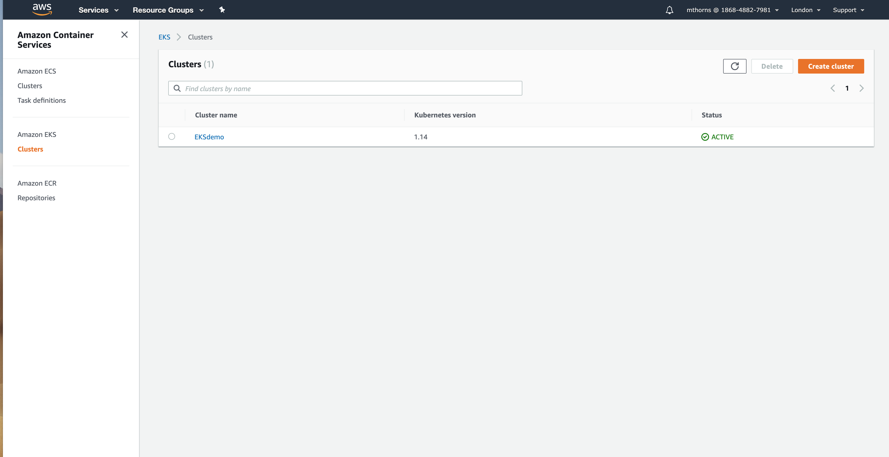

Note that the current API endpoint access is Public.  

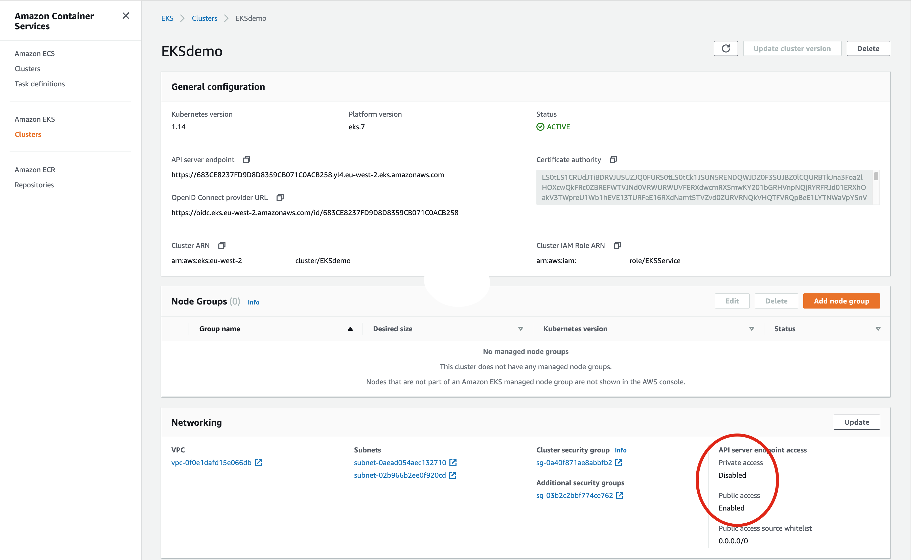

Disable Public access, enable Private access, then click on the 'Update' button.

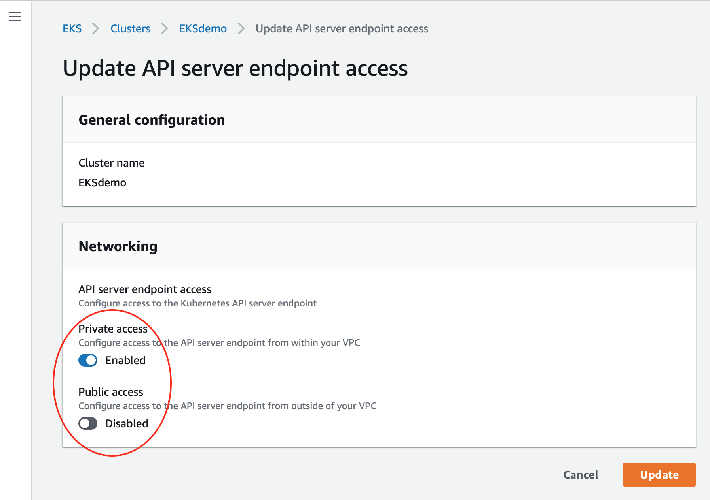

After around 10 minutes or so the API endpoint should be Private as shown:

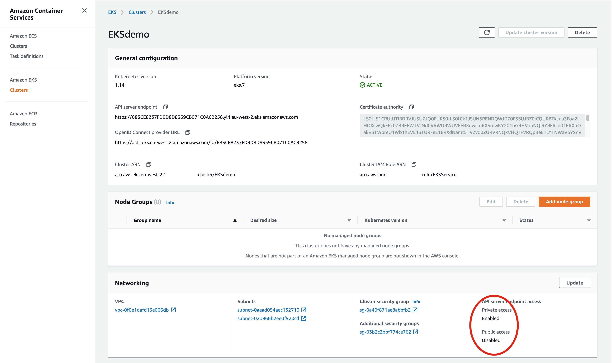


### 5. Peer the VPCs to enable communication between EC2 Bastion instance and the EKS nodes

Peering the VPCs is outside of the scope of this demo but there are numerous examples of this on the internet. Peering between the VPCs must be enabled, as the EKS private endpoint will have a CIDR address inside the VPC CIDR range. In order to communicate with the EKS API the bastion server will need to be able to route to the EKS VPC, using this peering connection.

### 6. Create kubeconfig on bastion server

The following command executed on the bastion EC2 instance creates the relevant kubeconfig file in order that kubectl can connect to the correct EKS cluster:

```
aws eks --region <region> update-kubeconfig --name <cluster_name>
```

In our EKS demo example the command is:

```
aws eks --region eu-west-2 update-kubeconfig --name EKSdemo

```

### 7. Allow Bastian Server access to API Server on Port 443


In the AWS console navigate to EC2/SecurityGroups and on the ControlPlane Security Group edit the Inbound Rules to allow access from the bastion server Security Group on port 443.

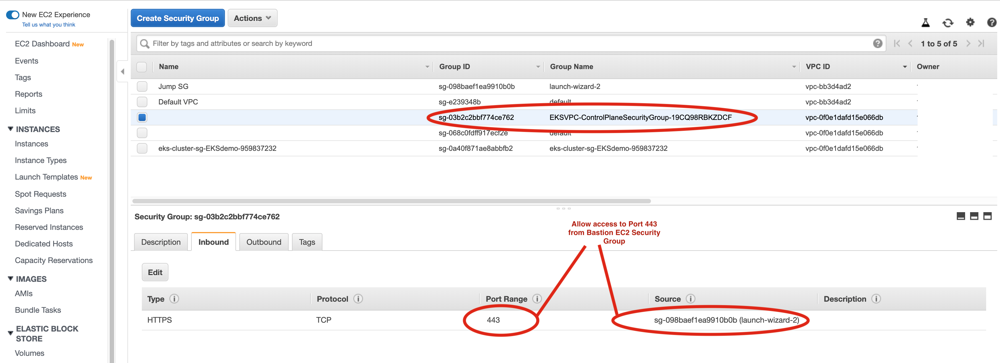

### 8. Prove access to the newly created EKSdemo cluster over Private Endpoint

From the command line on the bastion server:

```
$ kubectl get svc
NAME         TYPE        CLUSTER-IP   EXTERNAL-IP   PORT(S)   AGE
kubernetes   ClusterIP   10.100.0.1   <none>        443/TCP   67m
```

### 9. Create Proxy using EKS-Proxy.yaml

In the 'Proxy Parameter' provide the allowable outgoing domains which make up the allowed URL whitelist.

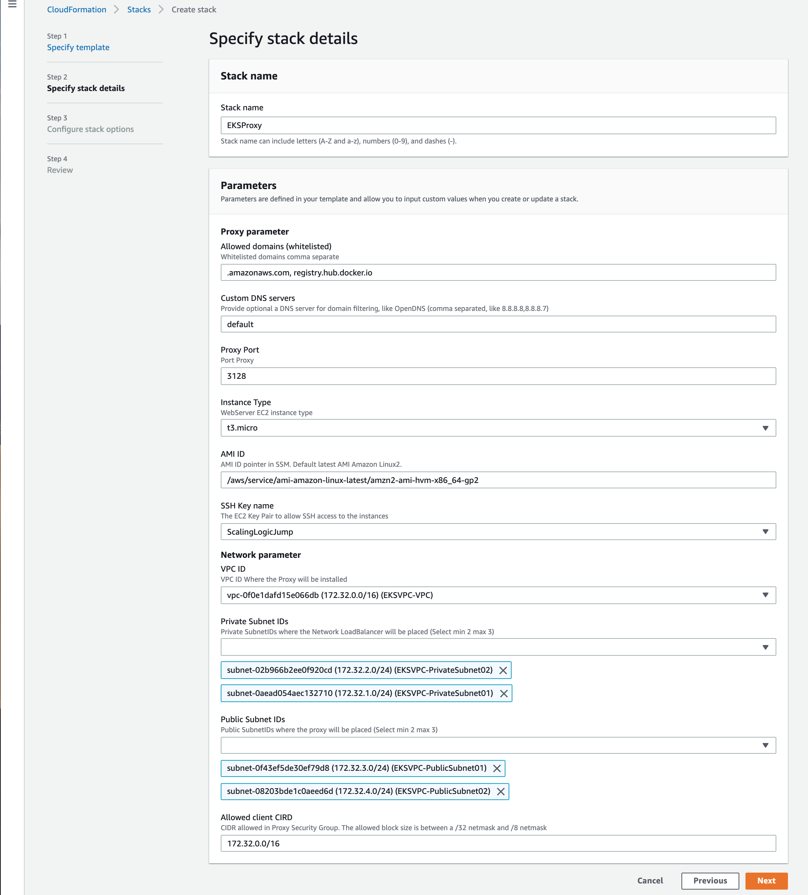

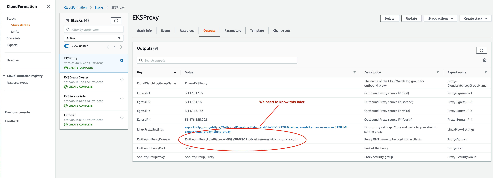

### 10. Create EKS Node Group using EKS-Nodegroup-WithProxy.yaml

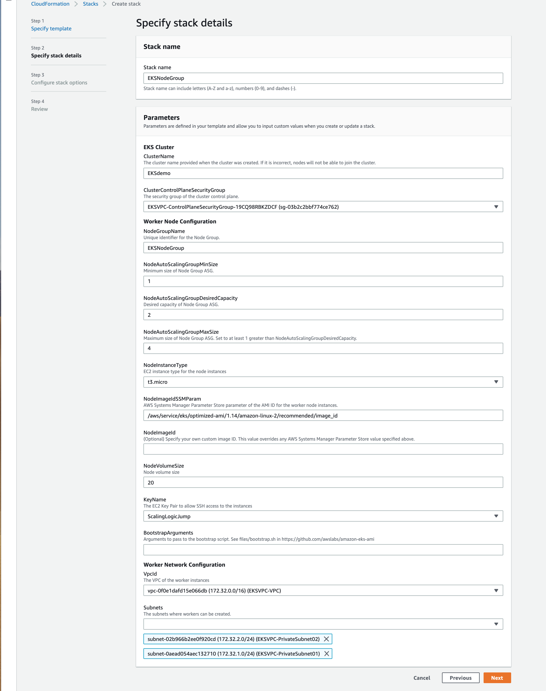


From the Cloudformation Outputs, note down the Outbound Proxy Domain as we will require this later.

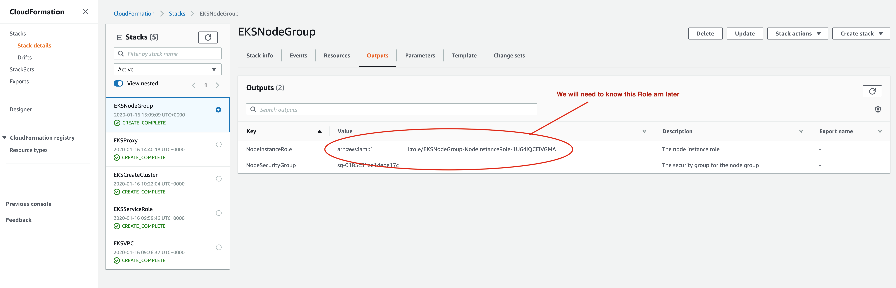


### 11. EKS Cloudformation Review

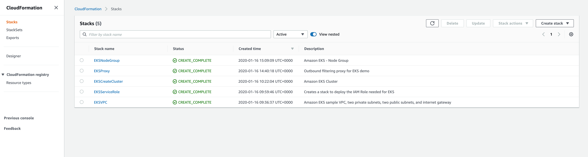


At this stage the EKS nodes have been created, but have not yet been able to join the cluster:


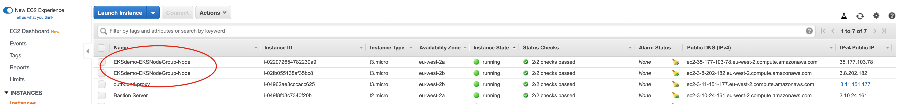

```
$ kubectl get nodes
No resources found.
```


The coredns daemonset is running on the cluster, but the pods cannot be scheduled as there are no nodes avaliable.
```
$ kubectl get pods --all-namespaces
NAMESPACE     NAME                       READY   STATUS    RESTARTS   AGE
kube-system   coredns-85bb8bb6bc-76442   0/1     Pending   0          108m
kube-system   coredns-85bb8bb6bc-d4s5g   0/1     Pending   0          108m


[ec2-user@ip-172-31-0-79 ~]$ kubectl describe pod coredns-85bb8bb6bc-76442 -n kube-system
Name:               coredns-85bb8bb6bc-76442
.........
Status:             Pending
.........
Events:
  Type     Reason            Age                    From               Message
  ----     ------            ----                   ----               -------
  Warning  FailedScheduling  52s (x132 over 3h17m)  default-scheduler  no nodes available to schedule pod
```

As root, when logged on to one of the nodes, you will be able to see kubelet errors messages about being Unauthorized when trying to talk to the API endpoint 
```
# journalctl -u kubelet.service

Jan 16 14:50:08 ip-172-32-2-26.eu-west-2.compute.internal kubelet[3859]: E0116 14:50:08.474427    3859 reflector.go:126] k8s.io/client-go/informers/factory.go:133: Failed to list *v1beta1.RuntimeClass: Unauthorized
Jan 16 14:50:08 ip-172-32-2-26.eu-west-2.compute.internal kubelet[3859]: E0116 14:50:08.477039    3859 kubelet.go:2251] node "ip-172-32-2-26.eu-west-2.compute.internal" not found
Jan 16 14:50:08 ip-172-32-2-26.eu-west-2.compute.internal kubelet[3859]: E0116 14:50:08.498336    3859 reflector.go:126] k8s.io/client-go/informers/factory.go:133: Failed to list *v1beta1.CSIDriver: Unauthorized
Jan 16 14:50:08 ip-172-32-2-26.eu-west-2.compute.internal kubelet[3859]: E0116 14:50:08.502530    3859 reflector.go:126] k8s.io/kubernetes/pkg/kubelet/config/apiserver.go:47: Failed to list *v1.Pod: Unauthorized
Jan 16 14:50:08 ip-172-32-2-26.eu-west-2.compute.internal kubelet[3859]: E0116 14:50:08.577356    3859 kubelet.go:2251] node "ip-172-32-2-26.eu-west-2.compute.internal" not found
```

To resolve this issue, we must authorize the nodes to speak to the API.
To do this, the EKS authorisation ConfigMap must be downloaded, modified with the EKS Node Role, and then deployed to the EKS cluster

Firstly, on the bastion, download aws-auth-cm.yaml

```
curl -o aws-auth-cm.yaml https://amazon-eks.s3-us-west-2.amazonaws.com/cloudformation/2019-11-15/aws-auth-cm.yaml
```

Edit the aws-auth-cm.yaml file with the Node Group arn from the Cloudformation Outputs of the NodeGroup creation:

```
$ cat aws-auth-cm.yaml 
apiVersion: v1
kind: ConfigMap
metadata:
  name: aws-auth
  namespace: kube-system
data:
  mapRoles: |
    - rolearn: arn:aws:iam::<redacted>:role/EKSNodeGroup-NodeInstanceRole-1U64IQCEIVGMA
      username: system:node:{{EC2PrivateDNSName}}
      groups:
        - system:bootstrappers
        - system:nodes

$ kubectl apply -f aws-auth-cm.yaml


```

```
$ kubectl get nodes
NAME                                         STATUS     ROLES    AGE   VERSION
ip-172-32-1-161.eu-west-2.compute.internal   NotReady   <none>   44s   v1.14.8-eks-b8860f
ip-172-32-2-130.eu-west-2.compute.internal   NotReady   <none>   45s   v1.14.8-eks-b8860f

$ kubectl get pods --all-namespaces
NAMESPACE     NAME                       READY   STATUS              RESTARTS   AGE
kube-system   aws-node-f88fh             0/1     ContainerCreating   0          2s
kube-system   aws-node-lzgbs             0/1     ContainerCreating   0          4s
kube-system   coredns-85bb8bb6bc-76442   0/1     Pending             0          4h45m
kube-system   coredns-85bb8bb6bc-d4s5g   0/1     Pending             0          4h45m
kube-system   kube-proxy-b2wgb           0/1     ContainerCreating   0          4s
kube-system   kube-proxy-p5lxp           0/1     ContainerCreating   0          2s


$ kubectl get pods --all-namespaces
NAMESPACE     NAME                       READY   STATUS    RESTARTS   AGE
kube-system   aws-node-f88fh             1/1     Running   0          30m
kube-system   aws-node-lzgbs             1/1     Running   0          30m
kube-system   coredns-85bb8bb6bc-76442   0/1     Pending   0          5h15m
kube-system   coredns-85bb8bb6bc-d4s5g   0/1     Pending   0          5h15m
kube-system   kube-proxy-b2wgb           1/1     Running   0          30m
kube-system   kube-proxy-p5lxp           1/1     Running   0          30m

$ kubectl get nodes
NAME                                         STATUS     ROLES    AGE   VERSION
ip-172-32-1-214.eu-west-2.compute.internal   NotReady   <none>   30m   v1.14.8-eks-b8860f
ip-172-32-2-210.eu-west-2.compute.internal   NotReady   <none>   30m   v1.14.8-eks-b8860f

```

We now have the nodes up, but with a status of 'NotReady'.  

To fix this we need to allow the aws-node, and kube-proxy daemonset pods to proxy out by injecting the appropriate http_proxy and no_proxy environment variables:


```
kubectl get service kubernetes -o jsonpath='{.spec.clusterIP}'; echo
```

This returns either 10.100.0.1, or 172.20.0.1, which means that your cluster IP CIDR block is either 10.100.0.0/16 or 172.20.0.0/16.

We need to create a YAML file (proxy-env-vars-config.yaml) as below, and edit it as per the example.

In our example:
 - Cluster IP CIDR range is 10.100.0.0/16
 - Proxy URL is http://OutboundProxyLoadBalancer-969e3fb6f912fb6c.elb.eu-west-2.amazonaws.com:3128
 - EKS cluster endpoint is 683CE8237FD9D8D8359CB071C0ACB258.yl4.eu-west-2.eks.amazonaws.com

All other values should stay the same (assumes VPC S3 endpoint for access to S3 buckets).

```
$cat proxy-env-vars-config.yaml 

apiVersion: v1
kind: ConfigMap
metadata:
  name: proxy-environment-variables
  namespace: kube-system
data:
  HTTPS_PROXY: http://OutboundProxyLoadBalancer-969e3fb6f912fb6c.elb.eu-west-2.amazonaws.com:3128
  https_proxy: http://OutboundProxyLoadBalancer-969e3fb6f912fb6c.elb.eu-west-2.amazonaws.com:3128
  HTTP_PROXY: http://OutboundProxyLoadBalancer-969e3fb6f912fb6c.elb.eu-west-2.amazonaws.com:3128
  http_proxy: http://OutboundProxyLoadBalancer-969e3fb6f912fb6c.elb.eu-west-2.amazonaws.com:3128
  NO_PROXY: 10.100.0.0/16,localhost,127.0.0.1,172.32.0.0/16,169.254.169.254,.internal,.s3.amazonaws.com,.s3.eu-west-2.amazonaws.com,683CE8237FD9D8D8359CB071C0ACB258.yl4.eu-west-2.eks.amazonaws.com
  no_proxy: 10.100.0.0/16,localhost,127.0.0.1,172.32.0.0/16,169.254.169.254,.internal,.s3.amazonaws.com,.s3.eu-west-2.amazonaws.com,683CE8237FD9D8D8359CB071C0ACB258.yl4.eu-west-2.eks.amazonaws.com
```

Apply the configmap to the EKS cluster, and patch the aws-node and kube-proxy daemonset pods

```
$ kubectl apply -f proxy-env-vars-config.yaml

$ kubectl patch -n kube-system -p '{ "spec": {"template": { "spec": { "containers": [ { "name": "aws-node", "envFrom": [ { "configMapRef": {"name": "proxy-environment-variables"} } ] } ] } } } }' daemonset aws-node
$ kubectl patch -n kube-system -p '{ "spec": {"template":{ "spec": { "containers": [ { "name": "kube-proxy", "envFrom": [ { "configMapRef": {"name": "proxy-environment-variables"} } ] } ] } } } }' daemonset kube-proxy

```

```
kubectl set env daemonset/kube-proxy --namespace=kube-system --from=configmap/proxy-environment-variables --containers='*'
kubectl set env daemonset/aws-node --namespace=kube-system --from=configmap/proxy-environment-variables --containers='*'
```

The aws-node and kube-proxy daemonset pods will re-start and the http_proxy and no_proxy environment variables will be onboarded into the pod environment.

```
$ kubectl get pods --all-namespaces
NAMESPACE     NAME                       READY   STATUS        RESTARTS   AGE
kube-system   aws-node-f88fh             1/1     Running       0          34m
kube-system   aws-node-lzgbs             1/1     Terminating   0          34m
kube-system   coredns-85bb8bb6bc-76442   0/1     Pending       0          5h20m
kube-system   coredns-85bb8bb6bc-d4s5g   0/1     Pending       0          5h20m
kube-system   kube-proxy-b2wgb           0/1     Terminating   0          34m
kube-system   kube-proxy-p5lxp           1/1     Running       0          34m


$ kubectl get pods --all-namespaces
NAMESPACE     NAME                       READY   STATUS    RESTARTS   AGE
kube-system   aws-node-7np49             1/1     Running   0          40s
kube-system   aws-node-bcqk9             1/1     Running   0          5s
kube-system   coredns-85bb8bb6bc-76442   1/1     Running   0          5h21m
kube-system   coredns-85bb8bb6bc-d4s5g   1/1     Running   0          5h21m
kube-system   kube-proxy-g8mf6           1/1     Running   0          60s
kube-system   kube-proxy-hcqcg           1/1     Running   0          46s
```

All EKS pods should now be in a 'Running' state.

EKS is now configured with private API, and outgoing http/https requests to the internet are made via a whitelist controlled proxy. 

## References

[How can I automate the configuration of HTTP proxy for Amazon EKS worker nodes with user data](https://aws.amazon.com/premiumsupport/knowledge-center/eks-http-proxy-configuration-automation/)

[How to set up an outbound VPC proxy with domain whitelisting and content filtering](https://aws.amazon.com/blogs/security/how-to-set-up-an-outbound-vpc-proxy-with-domain-whitelisting-and-content-filtering/)